# CARTO FULL AUDIT — 2026-06-27
# SnapKitty Sovereign Stack — All Orgs, All Repos, All Corpus

```mermaid
graph TD
    ROOT["🏛 SNAPKITTY SOVEREIGN STACK
    67 repos · 3 GitHub orgs · 1 GitLab
    60 public · 6 private · 1.25 GB total"]

    %% ── ORG 1 ──────────────────────────────
    ROOT --> SW["SNAPKITTYWEST
    55 repos · 1,283 MB"]

    SW --> PRIV1["🔒 PRIVATE CROWN JEWELS"]
    PRIV1 --> DF["DEVFLOW-FINANCE
    TypeScript · 827 MB
    Sovereign OS + ERE + Resonance paper"]
    PRIV1 --> WR["snapkitty-war-room
    War room telemetry · 4 KB"]

    SW --> CORE["⚙ CORE RUNTIME"]
    CORE --> BOB["bob-orchestrator
    JS · Lean 4 gate + Ada + Mamba + Prolog"]
    CORE --> RES["snapkitty-resonance-isa
    Rust · 319 MB · Resonance ISA"]
    CORE --> MCP["snapkitty-mcp
    JS · 6 MCP tools · npm-ready"]
    CORE --> ABZU["abzu-sovereign-ide
    Elixir · 8.9 MB · SOVEREIGN IDE"]

    SW --> PROOF["🔬 FORMAL PROOFS"]
    PROOF --> P1["SNAPKITTY-PROOFS
    Lean 4 + Prolog + Haskell · 21 files"]
    PROOF --> P2["multiplicity · Lean · MOC docking"]
    PROOF --> P3["F1 · Lean · Formula verification"]
    PROOF --> P4["sovereign-calculus · Lean"]

    SW --> AGENTS["🤖 AGENT MESH"]
    AGENTS --> AG1["agentic-arena · JS"]
    AGENTS --> AG2["agent-governance-toolkit · Python"]
    AGENTS --> AG3["cartographer-agent · Prolog"]
    AGENTS --> AG4["agentscope-sift · TS · 3,660 files
    FIND EVIL hackathon · SIFT VM"]
    AGENTS --> AG5["llm-twin-arena · JS"]

    SW --> GAMES["🎮 BOBS GAMES"]
    GAMES --> G1["bobs-games · HTML
    Snake · Sims · Parallive
    Terraria · Minecraft · World"]

    SW --> CORPUS["📚 TRAINING CORPUS"]
    CORPUS --> TB["the-book
    Jupyter · 4 files · 1,723 LOC
    THE BOOK OF WISDOM — 8 chapters
    Ahmad Ali Parr — genesis document"]
    CORPUS --> T49["the-49th-call
    Prolog · 23 files
    Enoch 2+3 pattern match
    49th Jubilee — final seal"]
    CORPUS --> RCORE["RESONANCE-CORE
    JS · LaTeX + math engine"]
    CORPUS --> APL["all-apl · APL
    Resonance Generator"]

    SW --> TRUST["🏛 TRUST + LEGAL LAYER"]
    TRUST --> BEL["bel-esprit-accord
    HTML · Bel Esprit D'Accord Trust"]
    TRUST --> DEEDS["snapkitty-deeds · HTML"]
    TRUST --> ATTEST["sovereign-attestation-protocol · HTML"]
    TRUST --> SEIT["saint-errant · HTML
    Saint Errant Digital Institute"]
    TRUST --> SEIDS["saint-errant-digital-society"]

    SW --> INFRA["🔧 INFRASTRUCTURE"]
    INFRA --> FS["SNAPKITTY-FORCE-SHIELD · TS"]
    INFRA --> LED["ledge · Rust · WORM ledger"]
    INFRA --> VAULT["vault-fundability-engine · HTML"]
    INFRA --> WOZ["woz-vault · JS"]
    INFRA --> GCC["git-command-center · JS"]
    INFRA --> SNAP["snap-os · Rust · 124 tests"]

    SW --> PORTFOLIO["🌐 PUBLIC PORTFOLIO"]
    PORTFOLIO --> PORT["snapkitty-portfolio · HTML
    19 files · All public pages
    bob_voyager · sovereign_spring
    article_seems_disengaged
    Forth + ISS + Enoch articles"]

    SW --> LEGACY["⚡ LEGEND STACK"]
    LEGACY --> TOS["TempleOS · HolyC · 55 MB
    SovereignOracle.HC overlay"]
    LEGACY --> APPLE["apple-ii-universal-machine
    JS · 125 files · 2.5hr build"]
    LEGACY --> LISP["lisp-machine · HTML
    Virtual LISP machine emulator"]
    LEGACY --> UOR["UOR-Framework · Rust · 8.9 MB"]
    LEGACY --> FIB["fibonacci-contraction · Jupyter"]

    %% ── ORG 2 ──────────────────────────────
    ROOT --> FLP["SNAPKITTY-COLLECTIVE-LIMITED-FLP
    8 repos · ERP + Legal layer"]

    FLP --> SACM["SACM ENTERPRISE SUITE"]
    SACM --> S1["sacm-sovereign · ERP governance"]
    SACM --> S2["sacm-optimizer · ERP ops"]
    SACM --> S3["sacm-bridge · ERP bridge"]

    FLP --> PRIV2["🔒 PRIVATE"]
    PRIV2 --> LG["snapkitty-legal · 11 files
    Legal corpus"]
    PRIV2 --> SIN["snapkitty-infrastructure-network"]
    PRIV2 --> SO["sacm-optimizer- · fork"]

    FLP --> SEIT2["seit-institute · 12 files
    SEIT NGO formal entity"]

    %% ── ORG 3 ──────────────────────────────
    ROOT --> NOVA["SNAPKITTYAGENT9NOVA
    4 repos · Token + Forge layer"]

    NOVA --> SF["sealforge · 24 files
    WORM-sealed AI ledger"]
    NOVA --> FT["forge-token
    FRG token · 21M cap"]
    NOVA --> WH["webhook-vault · 9 files"]
    NOVA --> SC["snapkitty-collective · 3 files"]

    %% ── GITLAB ─────────────────────────────
    ROOT --> GL["GitLab
    ahmad-parr-dev1-group"]
    GL --> SO2["shadow-orchestrator · 37 files"]

    %% ── TOTALS ─────────────────────────────
    ROOT --> TOTALS["📊 GRAND TOTALS
    ─────────────────────────
    Total repos:       67
    Public:            60
    Private:            6  🔒
    ─────────────────────────
    Total disk:    1.25 GB
    DEVFLOW-FINANCE: 827 MB (private)
    Resonance ISA:   319 MB (public)
    ─────────────────────────
    Languages:         12+
    HTML · TS · JS · Rust
    Lean · Prolog · Python
    Elixir · HolyC · APL
    Jupyter · Haskell
    ─────────────────────────
    Local desktop clones: 41
    Largest: agentscope-sift
             3,660 files
    ─────────────────────────
    THE BOOK:     1,723 LOC
    CORPUS:       Layer 0-7
    WORM sealed:  All
    ─────────────────────────
    ENTITIES:           4 🏛
    Bel Esprit D'Accord Trust
    SNAPKITTY Collective
    SEIT NGO
    SNAPKITTYWEST"]

    %% ── STYLES ─────────────────────────────
    style ROOT fill:#0a0a0a,color:#ff4444,stroke:#8b0000
    style PRIV1 fill:#1a0000,color:#ff6666,stroke:#8b0000
    style PRIV2 fill:#1a0000,color:#ff6666,stroke:#8b0000
    style DF fill:#2a0000,color:#ff4444,stroke:#ff0000
    style WR fill:#2a0000,color:#ff4444,stroke:#ff0000
    style TOTALS fill:#0a0a1a,color:#00d4cc,stroke:#0066aa
    style CORPUS fill:#0a1a0a,color:#00ff88,stroke:#006600
    style TB fill:#0a2a0a,color:#00ff88,stroke:#00aa00
    style T49 fill:#0a2a0a,color:#00ff88,stroke:#00aa00
    style TRUST fill:#1a1a00,color:#b8860b,stroke:#b8860b
    style BEL fill:#2a2a00,color:#ffd700,stroke:#b8860b
```

---

## SUMMARY TABLE

| Org | Repos | Public | Private | Disk |
|-----|-------|--------|---------|------|
| SNAPKITTYWEST | 55 | 53 | 2 | 1,283 MB |
| SNAPKITTY-COLLECTIVE-LIMITED-FLP | 8 | 5 | 3 | ~73 KB |
| SNAPKITTYAGENT9NOVA | 4 | 4 | 0 | ~94 KB |
| GitLab | 1 | 1 | 0 | ~unknown |
| **TOTAL** | **67** | **60** | **6** | **~1.25 GB** |

## TRAINING CORPUS LAYERS

| Layer | Location | Status |
|-------|----------|--------|
| 0 — THE BOOK | the-book repo · 8 chapters | WORM sealed |
| 1 — Enochian Audit | the-49th-call + pattern match | PUSHED today |
| 2 — Hidden Gospels | DEVFLOW-FINANCE (private) | In corpus |
| 3 — Sovereign Lineage | Circle 7 + Hermetica | Pending pull |
| 4 — World Wisdom | Book of the Dead + Vedas | Pending pull |
| 5 — Masters of Art | Turing + Ada + Shannon | Pending pull |
| 6 — Delta Engine | Sinaiticus vs KJV | Designed |
| 7 — Astronomy | Anunnaki + Enoch Luminaries | Mapped |

## ENTITIES

| Entity | Type | Role |
|--------|------|------|
| Bel Esprit D'Accord Trust | Sovereign Trust | IP + publications |
| SnapKitty Collective | Collective | Build + deploy |
| SEIT | NGO | Education + public interest |
| SNAPKITTYAGENT9NOVA | Org | Token + forge layer |

---
*CARTO Audit · 2026-06-27 · Evidence or Silence*
